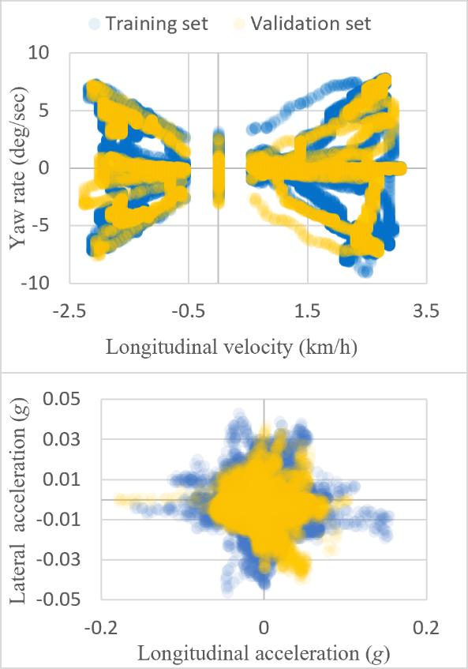

# 
Neural Network Modeling for Vehicle Dynamics in Parking Assistance Control

## Abstract
This paper presents the development and validation of a neural state-space (NSS) model for simulating vehicle dynamics in automated parking systems. Utilizing a dual-network architecture composed of multi-layer perceptrons (MLPs), the model predicts vehicle dynamics data within a state-space framework. A cornerstone of this model is its novel state network, which integrates a kinematics-based state limiter specifically designed for inference, effectively managing transitions between different drive modes. The Exeed Sterra ES by Chery served as the test vehicle, with its onboard sensors facilitating real-time data acquisition for both model training and validation. To address sensor limitations at low speeds, a tailored loss function is employed during training. Results demonstrate the model’s robustness and accuracy in long-term vehicle dynamics predictions, particularly under conditions characterized by frequent mode transitions and low-speed maneuvers common in parking assistance systems.

## 1 Introduction
In the development of intelligent-driving vehicle products, securing regulatory approval is essential, and the requirements for such approval vary by country. High-fidelity simulations with established credibility are crucial for meeting these regulatory standards. They provide a reliable method to assess vehicle performance and safety under varied conditions. These simulations ensure compliance by accurately modeling vehicle dynamics, which is fundamental for evaluating the performance of intelligent-driving vehicles in real-world scenarios. Hence, accurate vehicle dynamics modeling is essential for both regulatory approval and the safe deployment of intelligent-driving technologies.

Shifting from traditional physics-based modeling, neural networks offer substantial enhancements in vehicle dynamics modeling by efficiently compressing and utilizing extensive real-world data. This method not only captures complex vehicle behaviors more accurately but also facilitates streamlined application of these models in practical scenarios, such as automated driving systems. With their capabilities for data compression and adaptive learning, neural networks can handle variations in vehicle behavior that conventional physics-based models often fail to predict. This adaptability is crucial in dynamic and unpredictable environments.
Previous studies have demonstrated the versatility of neural networks in modeling vehicle dynamics, yet there has been insufficient emphasis on automated parking systems. For instance, the study on the Baidu Apollo platform, while focusing on large-scale data, did not engage in an in-depth analysis and overlooked key aspects crucial for practical deployment. Other studies provided valuable insights into specific subsystems like tire-suspension and longitudinal vehicle dynamics, respectively, but their works did not encompass the broader spectrum of vehicular behavior. While studies advanced modeling techniques, they fell short in real-world applicability, particularly lacking in field tests and considerations of environmental factors. Similarly, studies showed potential in neural network-based modeling but were limited by the absence of field testing and lacked considerations for sensor noise and hardware constraints.

This study advances neural network-based vehicle dynamics modeling for automated parking systems by developing a refined model that addresses practical simulation challenges under varied operational conditions. By integrating real-world data and robust network architectures, this research aims to overcome previous limitations in drive mode transitions, sensor inaccuracies, and signal quality issues, significantly improving the practical deployment of intelligent parking solutions.

The remainder of this paper is organized as follows: Section 2 introduces the neural network-based vehicle dynamics modeling. Section 3 details the testing methodology. Section 4 discusses the results. The paper concludes with Section 5.

## 2 Neural State-Space Modeling
Vehicle dynamics are formulated within a state-space architecture, comprising a state equation and an output equation. Due to the inherent complexity and gaps in domain knowledge, these equations often cannot be simplified into straightforward analytical forms. To address this challenge, the NSS model is introduced, leveraging neural networks to represent these dynamics.

  
   
  <strong>Figure.1 Architecture of NSS model for automated parking systems</strong>

Figure 1 depicts the schematic of the NSS model’s architecture, specifically designed for automated parking systems. The model features a dual-network structure consisting of a state network and an output network. Each network is configured as a fully connected feedforward MLP.

The left MLP functions as the state network, computing the time derivative of the predicted vehicle state, formulated as:

$$
\frac{\mathrm{d}\hat{\mathbf{x}}(t)}{\mathrm{d}t} = \mathbf{W}_{\mathrm{s}}^{[l]} \sigma _{\mathrm{s}}^{[l-1]} \left( \cdots \sigma _{\mathrm{s}}^{[0]} \left ( \mathbf{W}_{\mathrm{s}}^{[0]} \begin{bmatrix} \hat{\mathbf{x}}(t) & \mathbf{u}(t) & d(t) \end{bmatrix}^{\mathrm{T}} + \mathbf{b}_{\mathrm{s}}^{[0]} \right) \cdots \right) + \mathbf{b}_{\mathrm{s}}^{[l]}
\tag{1}
$$

$$
	\frac{\mathrm{d}\hat{\mathbf{x}}(t)}{\mathrm{d}t} = \mathbf{W}_{\mathrm{s}}^{[l]} \sigma _{\mathrm{s}}^{[l-1]} \left( \cdots \sigma _{\mathrm{s}}^{[0]} \left ( \mathbf{W}_{\mathrm{s}}^{[0]} \begin{bmatrix} \hat{\mathbf{x}}(t) & \mathbf{u}(t) & d(t) \end{bmatrix}^{\mathrm{T}} + \mathbf{b}_{\mathrm{s}}^{[0]} \right) \cdots \right) + \mathbf{b}_{\mathrm{s}}^{[l]}
    \tag{1}
$$

where the state prediction vector is given by $\hat{\mathbf{x}} = \begin{bmatrix} \hat{V}_x & \hat{\dot{\psi}} \end{bmatrix}$, comprising the predictions of the longitudinal velocity $V_x$ and the yaw rate $\dot{\psi}$; the input vector is defined as $\mathbf{u} = \begin{bmatrix} \alpha_{\mathrm{accel}} & \beta_{\mathrm{decel}} & \delta_{\mathrm{sw}}\end{bmatrix}$, which represents the acceleration and deceleration commands issued by the ESP system, and the steering wheel angle commands issued by the EPS system; $d$ denotes the explicit drive mode during an automated parking process, where $d=0$ represents neutral or park, $d=1$ drive, and $d=-1$ indicates reverse; $\mathbf{W}_{\mathrm{s}}^{[i]}$ and $\mathbf{b}_{\mathrm{s}}^{[i]}$ are the weight matrices and the bias vectors, respectively, for the $i$-th layer of the state network, where $i=0,1,\dots,l$; $\sigma _{\mathrm{s}}^{[i]}(\cdot)$ represents the activation function for the i-th layer of the state network.

The integration of the derived state prediction over time allows the prediction of the next state vector at time $t+\Delta{t}$ by:

$$
	\hat{\mathbf{x}}(t+\Delta{t}) = \hat{\mathbf{x}}(t) + \int_{t}^{t+\Delta{t}} \frac{\mathrm{d}\hat{\mathbf{x}}(t)}{\mathrm{d}t} \cdot \mathrm{d}{t}
    \tag{2}
$$

Subsequently, $\hat{\mathbf{x}}(t+\Delta{t})$  is fed through a memory block, reverting to $\hat{\mathbf{x}}(t)$ for use as an input in the state network and the forthcoming output network. This feedback loop ensures continuous updating of predictions. Additionally, the other inputs $\mathbf{u}$ and $d$ are utilized only at the current time $t$, without consideration of past or future inputs, to meet the requirements for online X-in-the-loop simulation.

However, the future state prediction is not directly output as calculated by the above integration. Instead, a state limiter constrains $\hat{V}_x$ within a range determined by gear selection. Additionally, the kinematics equation is employed to calculate the ideal yaw rate from $\hat{V}_x$ and $\delta_{\mathrm{sw}}$:

$$
	\dot{\psi}_{\mathrm{ref}} = \frac{\hat{V}_x}{L} \cdot \tan \left( \frac{\delta_{\mathrm{sw}}}{i_{\mathrm{sw}}} \right)
    \tag{3}
$$

where $L$ is the wheelbase of the car, and $i_{\mathrm{sw}}$ is the steering ratio.

The limiter adjusts the ideal yaw rate prediction by adding an adjustable margin of tolerance $\eta=0.2$, which ensures that the yaw rate remains within bounds derived from the above kinematic calculation. Note that this limiter is applied only during the inference phase and is not used during the training process.

The right MLP functions as the output network, designed to generate the output vector prediction $\hat{\mathbf{y}}$. While this network operates independently from the state network, it utilizes the state predictions computed by the state network for the current time step:

$$
	\hat{\mathbf{y}}(t) = \mathbf{W}_{\mathrm{o}}^{[k]} \sigma _{\mathrm{o}}^{[k-1]} \left( \cdots \sigma _{\mathrm{o}}^{[0]} \left ( \mathbf{W}_{\mathrm{o}}^{[0]} \begin{bmatrix} \hat{\mathbf{x}}(t) & \mathbf{u}(t) \end{bmatrix}^{\mathrm{T}} + \mathbf{b}_{\mathrm{o}}^{[0]} \right) \cdots \right) + \mathbf{b}_{\mathrm{o}}^{[k]}
    \tag{4}
$$

where the output prediction vector is given by $\hat{\mathbf{y}} = \begin{bmatrix} \hat{a}_x & \hat{a}_y \end{bmatrix}$, comprising the predictions of the longitudinal and lateral accelerations. The subscript ‘o’ in the variables $\mathbf{W}_{\mathrm{o}}^{[k]}$, $\mathbf{b}_{\mathrm{o}}^{[k]}$, and $\sigma _{\mathrm{o}}^{[k-1]}$ denotes their association with the output network. Note that, in this configuration, the output network does not consider the drive mode $d$ in its computations.

The training approach optimizes the state and output networks independently using the L1 loss (MAE), which minimizes the average magnitude of errors between actual and predicted values. The loss function for the output network $\mathcal{L}_{\mathrm{o}}$ is expressed as:

$$
	\mathcal{L}_{\mathrm{o}} = \frac{1}{NT} \sum_{j=1}^{N} \sum_{t=0}^{T}  \left \| \mathbf{y}_j(t) - \hat{\mathbf{y}}_j(t) \right \| _1
    \tag{5}
$$

where $N$ denotes the batch size and $T$ represents the number of time steps per sample.

Due to limitations with the wheel speed sensor, which cannot accurately capture extremely low speeds (below 0.5 km/h) and shows abrupt drops to zero or sudden jumps from zero to this threshold, the model may encounter issues with velocity fitting. To address this, the loss function for the state network, $\mathcal{L}_{\mathrm{s}}$, excludes training data from these extremely low speeds by creating masked datasets $\mathbf{x}^*$ and $\hat{\mathbf{x}}^*$, and then calculates the loss as:

$$
	\mathcal{L}_{\mathrm{s}} = \frac{1}{NT} \sum_{j=1}^{N} \sum_{t=0}^{T}  \left \| \mathbf{x}_j^*(t) - \hat{\mathbf{x}}_j^*(t) \right \| _1
    \tag{6}
$$

This adjustment helps improve the accuracy of state prediction by focusing on reliable data points.

For practical deployment, the state network consists of six hidden layers ($l=6$) and the output network comprises three hidden layers ($k=3$), each populated with 64 neurons. The hyperbolic tangent ($\tanh$) activation function is employed across both networks. Additionally, min-max scaling is applied to scale the states, inputs, and outputs to the $[-1,1]$ interval to align with the activation function’s range.

## 3 Testing Design
To train the NSS model, the researchers conducted testing and data collection using a test vehicle, as illustrated in Figure 2. The vehicle operated under the automated parking system on a flat surface in an underground garage. The testing protocol included four types of left and right parking in/out maneuvers. Each maneuver was performed four times, resulting in a total of 16 trials. From each set of four, one trial was selected for the validation set, thus dividing the data into 12 trials for the training set and 4 trials for the validation set.

  
   
  <strong>Figure.2 Test vehicle – the Exeed Sterra ES by Chery</strong>

Ground truth values for the state variables were measured by the wheel speed sensors and the yaw rate sensor in the ESP system, and the output values were obtained from the acceleration sensors in the ACU. These signals were captured from the test vehicle’s CAN-FD network using a CAN analyzer. This setup replicates real-world conditions, where controllers rely solely on onboard sensor data for real-time decisions, ensuring greater simulation fidelity.

Figure 3 illustrates the scatter plot of the field test data, segmented into the training set and the validation set. The overlap in data distribution between both sets is evident. As mentioned earlier, it is noteworthy from the upper part of the figure that the display of vehicle state data reveals an absence of data ranging from 0 to 0.5625 km/h, attributed to limitations of the wheel speed sensors.

  
   
  <strong>Figure.3 Scatter plot of field test data</strong>

The training and inference were conducted on ThinkPad P16 Gen 1, equipped with a 12th Gen Intel Core i7-12800HX CPU and an NVIDIA RTX A4500 Laptop GPU, operating on Ubuntu 20.04. The NSS model was developed and tested using Python, with neural networks implemented in PyTorch, providing a flexible and efficient machine learning framework.

Training was performed using the Adam optimizer, tailored for noisy field test data by employing a small learning rate of $5×10^{-5}$ and a high epoch count of 32,000 to effectively minimize noise amplification in the loss function.

The simulation runs at a time step of 0.01 seconds, using control commands from untruncated field test data as inputs. Starting with the initial state $\hat{\mathbf{x}}(0)=\mathbf{x}(0)$, the NSS model operates in an open-loop configuration to predict subsequent states and outputs, with no feedback correction during inference.

## 4 Results and Discussion
Figure 4 illustrates the evolution of training loss over 32,000 epochs for the state and output networks. Initially, the state network exhibits a more rapid decline in training loss compared to the output network, resulting in a lower loss for the state network. However, as training progresses beyond the initial phase, the rate of decrease in training loss becomes similar for both networks.

  
   
  <strong>Figure.4 Training loss evolution for state and output networks</strong>

The training progress for the state and output networks spans a total of 19.16 hours, involving 12 dedicated trials. To structure the training set effectively, these trials are truncated into multiple distinct segments. This approach enhances parallel computation efficiency but reduces the number of time steps per segment, potentially impacting the NSS model’s long-term prediction robustness. To mitigate this, preprocessing standardizes each series by aligning them to the shortest series through initial truncation and, if necessary, additional end truncation. This balances computational efficiency with the preservation of sequential integrity, which is essential for maintaining model accuracy.

  
   
  <strong>Figure.5 Experimental and simulated data of automatic parking-out maneuver</strong>

  
   
  <strong>Figure.6 Experimental and simulated data of automatic parking-in maneuver</strong>

The NSS model is validated using original, untruncated datasets to assess its accuracy. Figures 5 and 6 illustrate discrepancies and alignments between experimental and simulated vehicle dynamic variables during two selected maneuvers in the validation set. Both the experimental and simulation results derive from identical control inputs, generated by the parking assistance controller within the test vehicle during the field test. This setup ensures direct comparisons of vehicle dynamics under real-world and simulated conditions.

These comparisons reveal the model’s adeptness in filtering and delineating dynamic responses, even during transitions in drive modes, as demonstrated in Figure 5. Furthermore, the proposed kinematics-based state limiter ensures that vehicle speeds remain within reasonable limits, facilitates a seamless transition of yaw rate near zero longitudinal velocity, and accommodates deviations from the reference yaw rate at higher speeds due to vehicle dynamics.

  
   
  <strong>Figure.7 MSE and MAE metrics of scaled vehicle dynamics variables</strong>

Figure 7 presents the MSE and MAE metrics for the vehicle dynamics variables scaled to the $[-1,1]$ range across the training and validation sets, showcasing the model’s generalization capabilities. The figure is divided into two sections: the left side displays the MSE results, and the right side shows the MAE results. Both metrics compare the results from the original, untruncated training set with those from the validation set.

It is evident that both metrics exhibit a proportional increase in the validation set, likely due to the reduced data volume used for validation. Specifically, the complete dataset consists of 16 trials, with 12 allocated for training and 4 for validation, indicating the necessity of incorporating a more varied dataset for enhanced accuracy.

Notable discrepancies in $\hat{V}_x$ can be attributed to the training strategy, where extremely low vehicle speeds are masked, yet evaluations utilize the original, unmasked data. Meanwhile, the larger errors observed in $\hat{a}_y$ are primarily a result from the inherently low magnitude of lateral accelerations during automated parking maneuvers (see Figure 3), leading to a higher signal-to-noise ratio.

## 5 Conclusions
This study introduces a NSS model for automated parking control, which effectively simulates vehicle dynamics through a data-driven approach. Validated through field testing, the model accurately represents both longitudinal and lateral dynamics, ensuring robust long-term prediction capabilities. Additionally, it incorporates a kinematics-based state limiter that facilitates seamless transition between drive modes and mitigates anomalies during simulations.

The model addresses challenges arising from sensor inaccuracies at extremely low vehicle speeds through optimized training strategies, supporting both real-time simulations and offline analysis. This approach also facilitates model-based controller design, enhancing research and development efforts in intelligent-driving products.

Future work will focus on refining this model for combined driving-parking automation scenarios, seeking to expand the range of intelligent driving functionalities and improve simulation fidelity across diverse conditions.